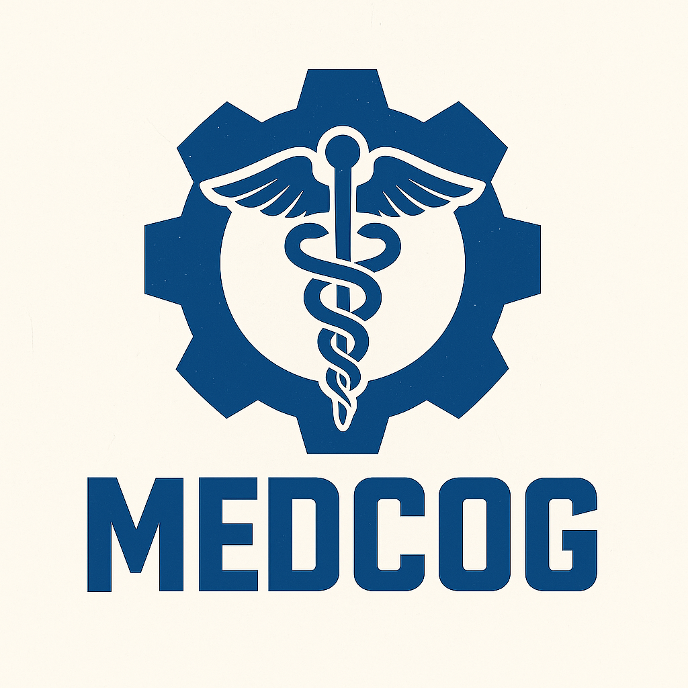

# MEDCOG - Sistema de Traductor de Medicamentos



**Versión 2.5** | Octubre 2025

## Descripción

MEDCOG es un sistema educativo dual que combina:

1. **Traductor de Medicamentos**: Herramienta para profesionales de la salud que genera recomendaciones personalizadas
2. **Analizador Léxico/Sintáctico**: Herramienta educativa para estudiantes de compiladores

## Características

- Sistema de cuentas locales con cifrado PBKDF2
- Gestión de datos de pacientes
- Recomendaciones personalizadas de medicamentos
- Sistema de detección de alergias
- Síntesis de voz para recomendaciones
- Exportación de recetas en PDF profesional
- Analizador léxico y sintáctico
- Editor de gramáticas

## Demo en Vivo

**[Ver Demo](https://diegozarzamorales.github.io/Medcog/)**

## Instalación Local

1. Clona el repositorio:
```bash
git clone https://github.com/DiegoZarzaMorales/Medcog.git
```

2. Abre `ProgramaPrincipal/index.html` en tu navegador

No requiere instalación de dependencias.

## Estructura del Proyecto

```
LyA2_DZyM/
├── index.html                      # Página de entrada
├── Imagenes/
│   └── medcog_logo.png            # Logo del sistema
├── ProgramaPrincipal/
│   ├── index.html                 # Aplicación principal
│   ├── script.js                  # Lógica del traductor
│   └── styles.css                 # Estilos principales
└── Analizador/
    ├── analyzer.html              # Interfaz del analizador
    ├── analyzer.js                # Lógica de análisis
    └── analyzer.css               # Estilos del analizador
```

## Uso

### Programa Principal

1. Crear cuenta o iniciar sesión
2. Completar ficha del paciente (nombre, edad, condición, alergias)
3. Ver recomendaciones de medicamentos
4. Guardar historial y descargar PDF

### Analizador de Código

1. Clic en "Analizador (Estudiante)"
2. Escribir o cargar código
3. Ejecutar análisis léxico o sintáctico
4. Ver tokens y árbol sintáctico

## Tecnologías

- **Frontend**: HTML5, CSS3, JavaScript ES6+
- **Cifrado**: Web Crypto API (PBKDF2)
- **Síntesis de Voz**: Speech Synthesis API
- **Almacenamiento**: LocalStorage, SessionStorage
- **PDF**: html2canvas 1.4.1, jsPDF 2.5.1

## Disclaimer

Esta es una herramienta EDUCATIVA e INFORMATIVA. NO sustituye la evaluación de un profesional de la salud. Siempre consulte con un médico antes de administrar medicamentos.

## Licencia

Proyecto educativo desarrollado para fines académicos - Lenguajes y Autómatas 2

## Autor

Diego Zarza Morales

---

_"Tecnología al servicio de tu bienestar."_

[Ver Proyecto en Vivo](https://diegozarzamorales.github.io/Medcog/) | [Contacto](mailto:l22210366@tectijuana.edu.mx)
